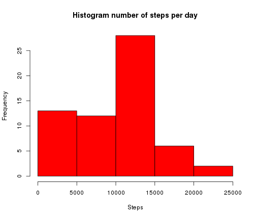
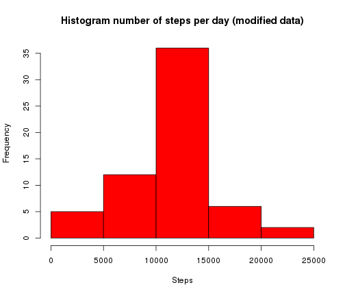

Peer assessment Reproducible Research
========================================================

#### Load the data (i.e. read.csv())

```r
activityData <- read.csv('/home/wijnand/R_workspace/5_Reproducible_Reseach/PeerAssessment_1/activity.csv')
str(activityData)
```

```
## 'data.frame':	17568 obs. of  3 variables:
##  $ steps   : int  NA NA NA NA NA NA NA NA NA NA ...
##  $ date    : Factor w/ 61 levels "2012-10-01","2012-10-02",..: 1 1 1 1 1 1 1 1 1 1 ...
##  $ interval: int  0 5 10 15 20 25 30 35 40 45 ...
```

#### Make a histogram of the total number of steps taken each day

```r
activityDataPerDay <- aggregate(activityData$steps, by=list(activityData$date), FUN="sum", na.rm=T)
colnames(activityDataPerDay) <- c("date", "sum_of_steps")
hist(activityDataPerDay$sum_of_steps, breaks=5, col='red', xlab="Steps", main="Histogram number of steps per day")
```

 

#### Calculate and report the mean and median total number of steps taken per day

```r
meanSteps <- mean(activityDataPerDay$sum_of_steps, na.rm=T)
medianSteps <- median(activityDataPerDay$sum_of_steps, na.rm=T)
```
Mean steps per day = 9354.2295

Median steps per day = 10395

#### Make a time series plot (i.e. type = "l") of the 5-minute interval (x-axis) and the average number of steps taken, averaged across all days (y-axis)

```r
activityDataPerFiveMin <- aggregate(activityData$steps, by=list(activityData$interval), FUN="mean", na.rm=T)
colnames(activityDataPerFiveMin) <- c("interval", "average_number_of_steps")
        
plot(activityDataPerFiveMin$interval, activityDataPerFiveMin$average_number_of_steps, type="l", 
             xlab="interval", ylab="average number of steps", main="Average number of steps per interval")
```

 

#### Which 5-minute interval, on average across all the days in the dataset, contains the maximum number of steps?

```r
ordered <- activityDataPerFiveMin[order(activityDataPerFiveMin$average_number_of_steps, decreasing=T),]
intervalLargestAvg <- ordered$interval[1]
```
Interval with maximum number of steps = 835

#### Calculate and report the total number of missing values in the dataset (i.e. the total number of rows with NAs)

```r
numberOfNA <- as.numeric(table(is.na(activityData)))[2]
```
Total number of missing values = 2304

#### Devise a strategy for filling in all of the missing values in the dataset. The strategy does not need to be sophisticated. For example, you could use the mean/median for that day, or the mean for that 5-minute interval, etc. Create a new dataset that is equal to the original dataset but with the missing data filled in.

```r
activityDataModified <- activityData
meanActivity <- mean(activityDataModified$steps, na.rm=T)
activityDataModified$steps <- ifelse(is.na(activityDataModified$steps), meanActivity, activityDataModified$steps)
table(is.na(activityDataModified))
```

```
## 
## FALSE 
## 52704
```

#### Make a histogram of the total number of steps taken each day and Calculate and report the mean and median total number of steps taken per day. Do these values differ from the estimates from the first part of the assignment? What is the impact of imputing missing data on the estimates of the total daily number of steps?

```r
activityDataPerDayModified <- aggregate(activityDataModified$steps, by=list(activityDataModified$date), FUN="sum", na.rm=T)
colnames(activityDataPerDayModified) <- c("date", "sum_of_steps")
hist(activityDataPerDayModified$sum_of_steps, breaks=5, col='red', xlab="Steps", main="Histogram number of steps per day (modified data)")
```

 


```r
meanStepsModified <- mean(activityDataPerDayModified$sum_of_steps)
medianStepsModified <- median(activityDataPerDayModified$sum_of_steps)
```
Mean steps (modified dataset) = 1.0766 &times; 10<sup>4</sup>

Median steps (modified dataset) = 1.0766 &times; 10<sup>4</sup>


#### Create a new factor variable in the dataset with two levels – “weekday” and “weekend” indicating whether a given date is a weekday or weekend day.

```r
activityDataModified$daytype <- as.factor(ifelse(as.numeric(format(as.Date(activityData$date), format="%u")) < 6, "week", "weekend"))
str(activityDataModified)
```

```
## 'data.frame':	17568 obs. of  4 variables:
##  $ steps   : num  37.4 37.4 37.4 37.4 37.4 ...
##  $ date    : Factor w/ 61 levels "2012-10-01","2012-10-02",..: 1 1 1 1 1 1 1 1 1 1 ...
##  $ interval: int  0 5 10 15 20 25 30 35 40 45 ...
##  $ daytype : Factor w/ 2 levels "week","weekend": 1 1 1 1 1 1 1 1 1 1 ...
```

#### Make a panel plot containing a time series plot (i.e. type = "l") of the 5-minute interval (x-axis) and the average number of steps taken, averaged across all weekday days or weekend days (y-axis). 

```r
weekData <- activityDataModified[activityDataModified$daytype=="week",]
activityDataPerFiveMinWeek <- aggregate(weekData$steps, by=list(weekData$interval), FUN="mean")
colnames(activityDataPerFiveMinWeek) <- c("interval", "average_number_of_steps")
        
weekendData <- activityDataModified[activityDataModified$daytype=="weekend",]
activityDataPerFiveMinWeekend <- aggregate(weekendData$steps, by=list(weekendData$interval), FUN="mean")
colnames(activityDataPerFiveMinWeekend) <- c("interval", "average_number_of_steps")
        
par(mfrow=c(2,1))
plot(activityDataPerFiveMinWeek$interval, activityDataPerFiveMinWeek$average_number_of_steps, type="l", xlab="interval", ylab="avg no steps (week)", main="Average number of steps per interval (week)")
plot(activityDataPerFiveMinWeekend$interval, activityDataPerFiveMinWeekend$average_number_of_steps, type="l", xlab="interval", ylab="avg no steps (weekend)", main="Average number of steps per interval (weekend)")
```

 
