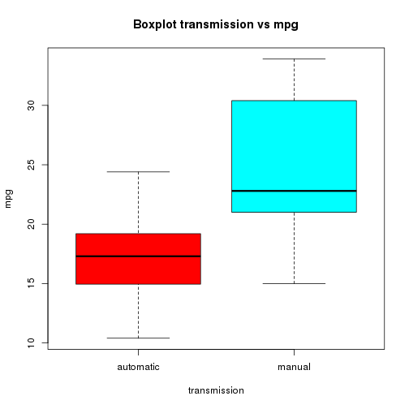

## Regression models - mtcars

## Executive summary
This reports looks into the question if automatic or manual transmission in a car has influence on the miles per gallon. The mtcars-dataset is used to do the analysis. The conclusion is that automatic transmission leads to a higher (this better) miles per gallon value than automatic transmission. In detail: the estimated expected MPG for automatic vehicles gives 7.24mpg less than manual transmission.

## Introduction
You work for Motor Trend, a magazine about the automobile industry. Looking at a data set of a collection of cars, they are interested in exploring the relationship between a set of variables and miles per gallon (MPG) (outcome). They are particularly interested in the following two questions:

- “Is an automatic or manual transmission better for MPG”
- "Quantify the MPG difference between automatic and manual transmissions"

#### Load the mtcars data & explore the data

```r
library(datasets)
carData <- mtcars
str(carData)
```

```
## 'data.frame':	32 obs. of  11 variables:
##  $ mpg : num  21 21 22.8 21.4 18.7 18.1 14.3 24.4 22.8 19.2 ...
##  $ cyl : num  6 6 4 6 8 6 8 4 4 6 ...
##  $ disp: num  160 160 108 258 360 ...
##  $ hp  : num  110 110 93 110 175 105 245 62 95 123 ...
##  $ drat: num  3.9 3.9 3.85 3.08 3.15 2.76 3.21 3.69 3.92 3.92 ...
##  $ wt  : num  2.62 2.88 2.32 3.21 3.44 ...
##  $ qsec: num  16.5 17 18.6 19.4 17 ...
##  $ vs  : num  0 0 1 1 0 1 0 1 1 1 ...
##  $ am  : num  1 1 1 0 0 0 0 0 0 0 ...
##  $ gear: num  4 4 4 3 3 3 3 4 4 4 ...
##  $ carb: num  4 4 1 1 2 1 4 2 2 4 ...
```

```r
table(carData$am)
```

```
## 
##  0  1 
## 19 13
```

```r
summary(carData$mpg)
```

```
##    Min. 1st Qu.  Median    Mean 3rd Qu.    Max. 
##    10.4    15.4    19.2    20.1    22.8    33.9
```
## Prepare data
#### We are interested in automatic / manual transmission. This variable am has 2 possible values so convert it to a factor variable. 

```r
carData$am <- as.factor(carData$am)
str(carData$am)
```

```
##  Factor w/ 2 levels "0","1": 2 2 2 1 1 1 1 1 1 1 ...
```
## Questions
#### Q1: Is an automatic or manual transmission better for MPG?

```r
summary(carData$mpg[carData$am==0]) # am == 0 means automatic
```

```
##    Min. 1st Qu.  Median    Mean 3rd Qu.    Max. 
##    10.4    15.0    17.3    17.1    19.2    24.4
```

```r
summary(carData$mpg[carData$am==1]) # am == 1 means manual
```

```
##    Min. 1st Qu.  Median    Mean 3rd Qu.    Max. 
##    15.0    21.0    22.8    24.4    30.4    33.9
```
The mean for manual transmission (24.4 MPG) is higher than the mean for automatic tranmission (17.1 MPG). Since we are looking for as much as miles per gallon ('more is better') a manual transmission is better for MPG.

#### We can check if there existsts a significance difference automatic and manual transmission in MPG.

```r
t.test(carData$mpg[carData$am==0], carData$mpg[carData$am==1])
```

```
## 
## 	Welch Two Sample t-test
## 
## data:  carData$mpg[carData$am == 0] and carData$mpg[carData$am == 1]
## t = -3.767, df = 18.33, p-value = 0.001374
## alternative hypothesis: true difference in means is not equal to 0
## 95 percent confidence interval:
##  -11.28  -3.21
## sample estimates:
## mean of x mean of y 
##     17.15     24.39
```
Since the p-value < 0.05 we can conclude there is a significant difference bwteen automatic and manual transmission in MPG.

#### Q2: Quantify the MPG difference between automatic and manual transmissions.

```r
linearModelFit <- lm(mpg ~ am, data=carData)
summary(linearModelFit)
```

```
## 
## Call:
## lm(formula = mpg ~ am, data = carData)
## 
## Residuals:
##    Min     1Q Median     3Q    Max 
## -9.392 -3.092 -0.297  3.244  9.508 
## 
## Coefficients:
##             Estimate Std. Error t value Pr(>|t|)    
## (Intercept)    17.15       1.12   15.25  1.1e-15 ***
## am1             7.24       1.76    4.11  0.00029 ***
## ---
## Signif. codes:  0 '***' 0.001 '**' 0.01 '*' 0.05 '.' 0.1 ' ' 1
## 
## Residual standard error: 4.9 on 30 degrees of freedom
## Multiple R-squared:  0.36,	Adjusted R-squared:  0.338 
## F-statistic: 16.9 on 1 and 30 DF,  p-value: 0.000285
```
The p-value is < 0.05 so the diffeence is significant.
The estimated expected MPG for automatic vehicles gives 7.24mpg less than manual transmission.

## Appendix

```r
boxplot(mpg ~ am, data=carData, main = "Boxplot transmission vs mpg", names = c("automatic", "manual"), ylab="mpg", xlab = "transmission", col=rainbow(2))
```

 

```r
plot(resid(linearModelFit))
```

 
